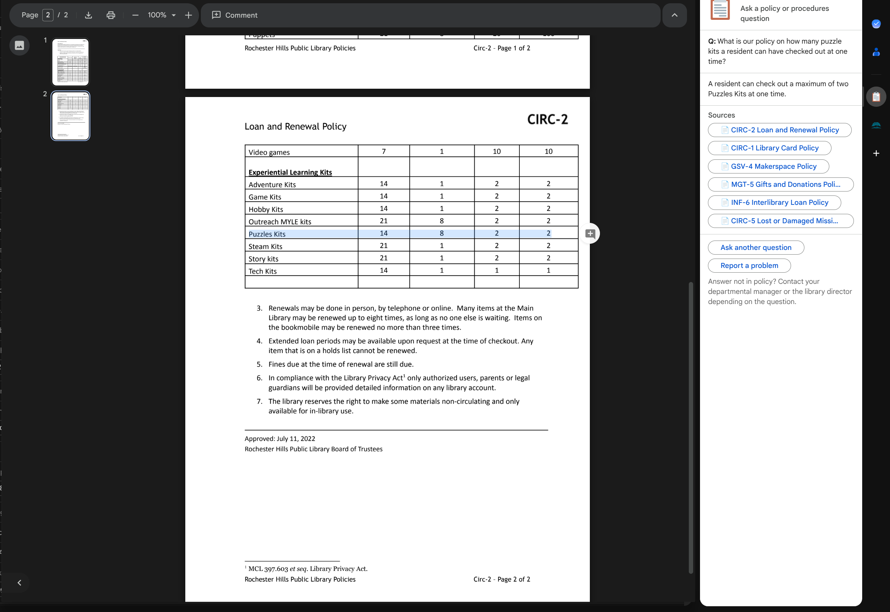
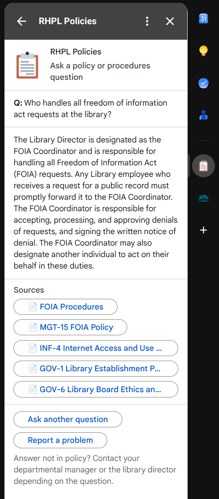
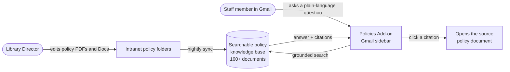

# RHPL Policies Add-on

An open-source Gmail sidebar add-on, built by Rochester Hills Public Library,
that lets staff search the library's **160+ board policies and procedures**
from right inside Gmail — ask a question in plain language, get a grounded
answer, and click straight through to the source policy.

## Why we built it

RHPL staff already have a great way to search internal documents: our on-prem
AI server running a local Qwen model over the library's document knowledge
base. That stays — staff can still leverage the local model for open-ended
document search whenever they want.

We built this add-on as an **additional benefit on top of that** — because we
wanted policy answers to be as easy to reach as possible. By building it as an
application right into the Gmail right sidebar, staff get quick, easy access to
hunt through our 160+ documents and files for specific policy verbiage
**without ever leaving their primary screen**. Most of the day already happens
in Gmail; now a policy question is one click away from wherever they're already
working.

## What it looks like

Click any source and the underlying policy document opens, so staff can verify
the answer against the original text:



Ask a question in the sidebar and get a grounded answer with the exact policies
it drew from, each one a clickable source:



## How it all fits together



1. The Library Director maintains the policies and procedures as normal, in the
   library's intranet folders.
2. A nightly job picks up changes, converts each document to clean text, and
   loads it into a searchable, grounded knowledge base.
3. A staff member asks a question from the Gmail sidebar.
4. The add-on searches the knowledge base and returns an answer **grounded in
   the actual policy text**, with each cited policy shown as a button.
5. Clicking a citation opens the source document, so the answer can always be
   traced back to the original policy.

## Answers you can trust

Policy questions are exactly the kind of thing where a confident-but-wrong
answer is worse than no answer. This add-on is built around three behaviors
that keep it trustworthy:

1. **Cite the policy.** Every answer is grounded in specific documents from the
   library's own policy set, and each source is surfaced as a clickable
   citation. Nothing is presented as fact without a document behind it.
2. **Refuse when the answer isn't in the policies.** The assistant doesn't
   invent answers or reason from general HR/library knowledge. If the question
   isn't covered by the policies, it says so and points the staff member to
   their departmental manager or the Library Director.
3. **Translate casual phrasing into the right vocabulary.** Staff can ask "time
   off when someone in my family dies" and the assistant maps it to the
   bereavement policy — they don't have to already know the formal term.

These behaviors are protected by an automated evaluation gate (see `eval/`): a
set of test questions covering factual accuracy, citation accuracy, correct
refusals, and zero-hallucination cases. The knowledge base has to clear that
bar before changes reach staff.

## Cost

At our scale, the underlying Vertex AI usage falls within its free limits, and
we don't expect staff usage to exceed those limits. We still put budget
guardrails in place just in case, so an unexpected spike can never turn into a
surprise bill:

| Layer | What it does |
|---|---|
| **Budget + email alerts** | Notifies as usage climbs toward the annual cap |
| **Hard-cap function** | Automatically detaches billing if the cap is reached |
| **Per-API quotas** | Caps request and token rates so a runaway loop hits a wall first |

The layers stack: a runaway loop hits the quota wall, alerts fire, and the hard
cap stops billing if alerts are ignored. See `RUNBOOK.md` for details.

## Repo layout

```
.
├── README.md                 This file
├── RUNBOOK.md                Day-to-day operations: cost cap, sync, ops
├── .env.template             Copy to .env and fill in (for the eval harness)
│
├── eval/                     Automated evaluation gate (the trust bar)
├── scripts/                  Setup, cost-guardrail, and nightly-sync scripts
└── gmail-addon/              The Gmail Add-on (Apps Script) project files
    └── icons/                Add-on listing assets
```

## Security & contributing

If you use AI coding tools while contributing, do **not** paste secrets, patron
data, or internal network details into AI context windows. Configuration values
(credentials, project IDs, internal URLs) belong in your local `.env` and
deployment config, never in committed code.

## Related projects

- [`esources`](https://github.com/RHPubLib/esources) — RHPL's open-source
  eResources service. This add-on reuses the same Gmail Add-on UX pattern as
  RHPL's other staff tools.

---

Built by [Rochester Hills Public Library](https://www.rhpl.org).
